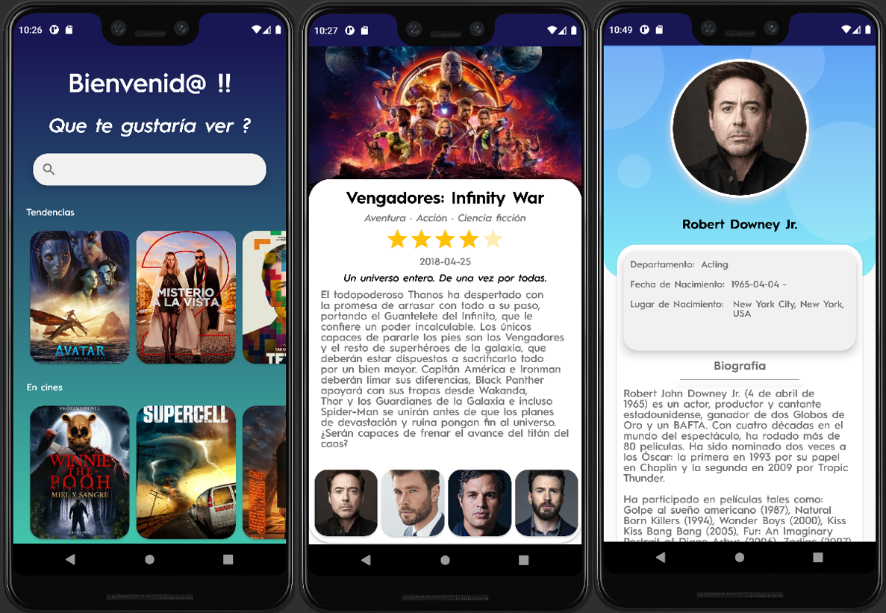

# TodoPeliculas

Aplicación Android desarrollada en Kotlin de Películas y toda su información (Actores,Popularidad...).

>Librerías
  
  - Picasso: Para transformar las urls en imágenes.
  - Retrofit 2: Librería encargada del consumo de la API.
  - Retrofit 2 Converter Gson: Para simplificar el proceso de pasar un JSON a una Data Class.
  - CircularImageView: Para imágenes circulares.
  
>API

- https://www.themoviedb.org

